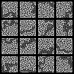
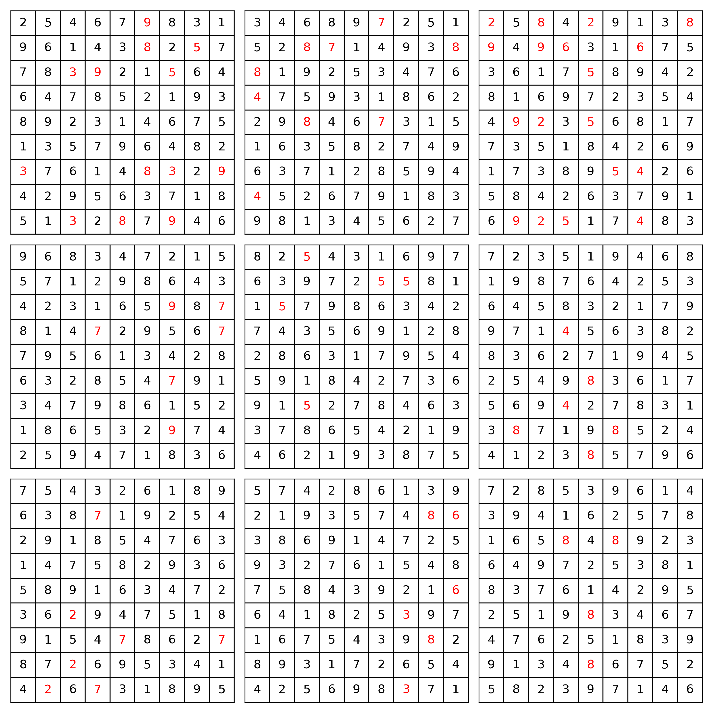

# Continuous-Time Diffusion Models for Discrete Data

[](https://github.com/paulffm/Master-Thesis/blob/master/LICENSE)

This repository is forked from
[Continuous-Time-Diffusion-Models-for-Discrete-Data](https://github.com/paulffm/Continuous-Time-Diffusion-Models-for-Discrete-Data)
which was developed as part of Paul Leonardo Heller's master thesis.
This fork adds **BitDiffusion** (implementation adapted from https://github.com/lucidrains/bit-diffusion.git) 
but excludes self-conditioning. The model has been tested on maze and Sudoku generation tasks.

## Installation

Follow these steps to clone the repository and install the dependencies:

### 1. Clone the repository

Clone the repository using the following command:

```sh
git clone https://github.com/khaendler/Continuous-Time-Diffusion-Models-for-Discrete-Data.git
cd Continuous-Time-Diffusion-Models-for-Discrete-Data
```

### 2. Create a virtual environment

Create a virtual environment to install dependencies in isolation:

```sh
python -m venv venv
source venv/bin/activate 
```

### 3. Install dependencies

Install the necessary dependencies using pip:

```sh
pip install -r requirements.txt
```

Note: I have only made the code work properly on Linux systems due to dependency issues.


## Overview

The implementation, training, and evaluation code for BitDiffusion can be found in ```./TAUnSDDM/lib/bitdiffusion/```. 
The corresponding configs can be found inside of ```./TAUnSDDM/config/config_bitdiffusion.py```. There are four configs
available:
- **MazeBitDiffusion**: trains BitDiffusion on a 7x7 maze
- **Maze14x14BitDiffusion**: trains BitDiffusion on a 14x14 maze
- **SudokuBitDiffusion**: trains BitDiffusion on Sudokus
- **PoweredBitDiffusion**: trains BitDiffusion on Sudokus with their values being powers of 2

## Usage

You can train a BitDiffusion model directly from the terminal.
For example, to train using the **MazeBitDiffusion** configuration, run:

```bash
python TAUnSDDM/lib/bitdiffusion/train.py --config_name MazeBitDiffusion
```

Model evaluation depends on the dataset used during training:

- **Maze models**: use `maze_eval.py`  
- **Sudoku models**: use `sudoku_eval.py`

For example, to evaluate a model trained with the **MazeBitDiffusion** configuration, run:

```bash
python TAUnSDDM/lib/bitdiffusion/maze_eval.py --config_name MazeBitDiffusion
```

The config files contain the following:

| Parameter | Description                                                        | Type |
|------------|--------------------------------------------------------------------|------|
| save_directory | Directory where model results and checkpoints are saved            | str |
| config.device | Device to be used for training (e.g., `"cuda:0"`, `"cpu"`)         | str |
| config.distributed | Whether to use distributed training                                | bool |
| config.num_gpus | Number of GPUs to use                                              | int |
| training.gradient_accumulate_every | Number of steps to accumulate gradients before updating            | int |
| training.train_lr | Learning rate for training                                         | float |
| training.adam_betas | Beta coefficients for the Adam optimizer                           | Tuple[float, float] |
| training.train_num_steps | Total number of training steps                                     | int |
| training.ema_update_every | Frequency (in steps) for EMA updates                               | int |
| training.ema_decay | Exponential moving average decay rate                              | float |
| training.save_and_sample_every | Frequency (in steps) for saving checkpoints and generating samples | int |
| training.num_samples | Number of samples to generate during checkpointing                 | int |
| training.results_folder | Directory where training results are saved                         | str |
| training.amp | Whether to use automatic mixed precision (AMP)                     | bool |
| training.mixed_precision_type | Type of mixed precision to use (e.g., `'fp16'`)                    | str |
| training.split_batches | Whether to split batches during training                           | bool |
| training.resume | Whether to resume training from a previous checkpoint              | bool |
| data.name | Name of the dataset used for training                              | str |
| data.batch_size | Number of samples per training batch                               | int |
| data.bits | Bit-depth used for encoding data                                   | int |
| data.S | Channel size (same as `data.bits`)                                 | int |
| data.dim_x | Horizontal dimension of the maze                                   | int |
| data.dim_y | Vertical dimension of the maze                                     | int |
| data.image_size | Computed image size (`dim_x + dim_y + 1`)                          | int |
| data.shape | Input data shape `[1, image_size, image_size]`                     | List[int] |
| data.crop_wall | Whether to crop maze walls in the dataset                          | bool |
| data.limit | Limit on the number of samples loaded from the dataset             | int |
| data.random_transform | Whether to apply random transformations to the data                | bool |
| model.concat_dim | Dimension along which features are concatenated                    | int |
| model.model_class | Model class used (e.g., `BitDiffusionSubset`)                      | class |
| model.timesteps | Number of diffusion timesteps                                      | int |
| model.use_ddim | Whether to use DDIM sampling                                       | bool |
| model.noise_schedule | Type of noise schedule (e.g., `'cosine'`)                          | str |
| model.time_difference | Time difference parameter for temporal conditioning                | float |
| model.bit_scale | Scaling factor for bit representation                              | float |
| model.net_class | Network class used (e.g., `ScoreNet`)                              | class |
| model.embed_dim | Dimensionality of embeddings in the model                          | int |

## Results


| Dataset                                      | Accuracy | Hellinger distance |
|----------------------------------------------|----------|--------------------|
| Maze (7x7)                                   | 92%      | 0.3                |
| Maze (14x14)                                 | 75.84%   | 0.0027             |
| Sudoku                                       | 9.4%     | 0.0002             |
| Powered Sudoku                               | 0.0%     | 0.512              |


Some generated 14x14 mazes and Sudokus:

<p align="center">
  
  
</p>
